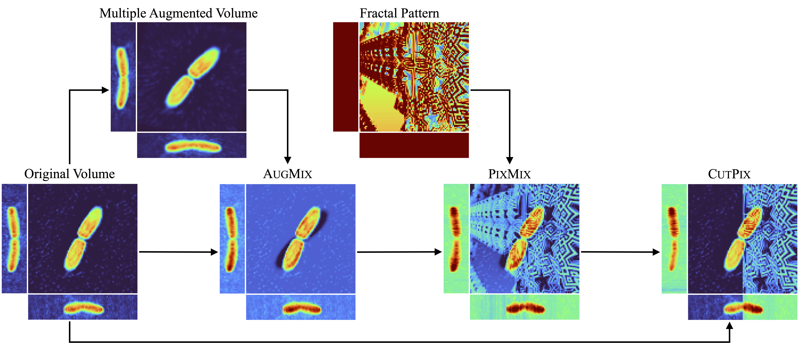

# CutPix

This is the repository for "Robustness Evaluation for Optical Diffraction Tomography" by  Warren Xie.


## Abstract
Optical Diffraction Tomography (ODT) is a promising technique for three-dimensional imaging, but practical use demands rigorous robustness testing due to real-world noise factors. Despite the growing importance of machine learning safety, robustness in ODT remains underexplored. We propose the first comprehensive robustness testing protocol
for ODT-based models by simulating 16 corruption scenarios to create a corrupted dataset. To enhance robustness and accuracy, we introduce CUTPIX, a data augmentation strategy that balances shape and texture information through fractal pattern mixing and a cut-and-concatenate approach. Additionally, we propose the calibrated Corrupted Error (cCE)
metric, providing a balanced performance evaluation on clean and corrupted data. Our experiments show that CUTPIX significantly improves robustness over existing techniques, particularly against pattern noise. This approach enhances the reliability of ODT-based models, advancing biomedical imaging and improving diagnostic accuracy in clinical settings.


## System requirements and installation guide
Installation should be fairly quick (typically less than an hour). On a computer with CUDA-compatible GPUs and Linux operating system (e.g., Ubuntu 16.04), install CUDA/cuDNN and Python 3 (tested on 3.10) with the following command:
```bash
➜ pip install -r requirements.txt
```

## Demo and instructions for use
### YAML script
`main.py` parses arguments from the `yaml_file`. 

Exmaple of `yaml_file`:

```yaml
# scripts/densenet/cutpix.yaml
path:
  dataset: dataset
  save_path: outs/densenet/cutpix

setup:
  num_epoch: 400
  image_size: (22, 64, 64)
  gpus: "0,1,2,3"
  cpus: 8
  batch_size: 32
  dim: 3
  mix: cutpix
  seed: 0

module:
  model:
    name: d121_3d
    num_classes: 19

  optim:
    name: AdamW
    lr: 0.001
    weight_decay: 0.001

  lr_scheduler:
    name: CosineAnnealingLR
    T_max: 400

  loss: [CrossEntropyLoss]
  loss_args:
    CrossEntropyLoss:
      reduction: mean
  loss_weight: [1.]
  val_metric: ConfusionMatrix
  test_metric: ConfusionMatrix
  metric_args:
    nlabels: 19
```

### Run
Run the python script with the following command as bellow.
```bash
➜ torchrun --nproc_per_node=4 main.py densenet/cutpix
```


## CUTPIX

